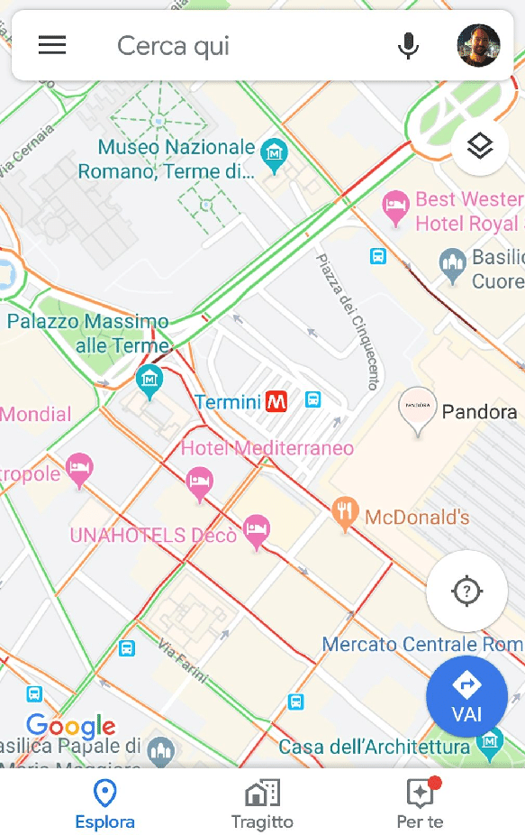
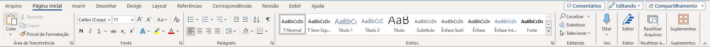
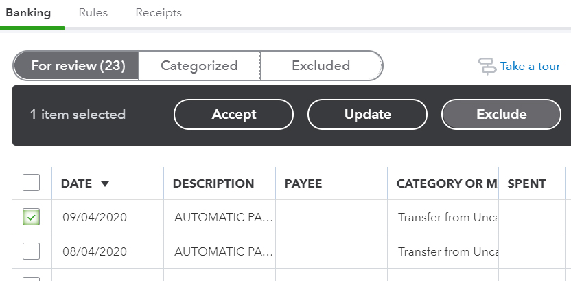
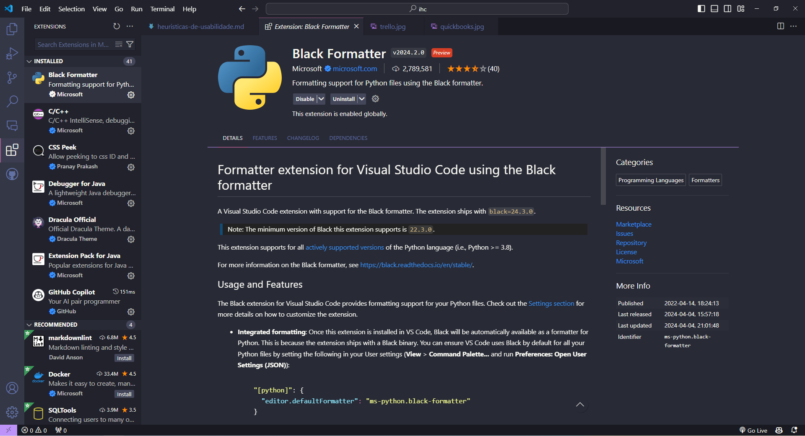

1. **Visibilidade do estado do sistema:**
   - *Bom exemplo:* O WhatsApp informa o usuário sobre o que está acontecendo com suas mensagens, como "Enviando", "Entregue" e "Lido".

   - *Mau exemplo:* Um software de edição de texto trava sem qualquer mensagem de erro, deixando o usuário sem saber se o trabalho foi salvo.

2. **Correspondência entre o sistema e o mundo real:**
   - *Bom exemplo:* O aplicativo Google Maps usa ícones universais para representar diferentes tipos de locais, como um ícone de garfo e faca para restaurantes.

   - *Mau exemplo:* Um aplicativo de calendário usa símbolos obscuros que não correspondem aos eventos que representam.

3. **Controle do usuário e liberdade:**
   - *Bom exemplo:* O Microsoft Word permite desfazer e refazer ações facilmente usando atalhos de teclado.
   - *Mau exemplo:* Um jogo de quebra-cabeça não permite que o jogador desista de uma jogada sem reiniciar o nível.

4. **Consistência e padrões:**
   - *Bom exemplo:* O pacote Microsoft Office segue padrões de interface consistentes em seus aplicativos, tornando a navegação fácil para os usuários.

   - *Mau exemplo:* Um conjunto de aplicativos de uma startup usa interfaces diferentes, tornando difícil para os usuários navegarem entre eles.

5. **Prevenção de erros:**
   - *Bom exemplo:* O QuickBooks avisa o usuário antes de excluir permanentemente uma entrada contábil.

   - *Mau exemplo:* O aplicativo de email permite que o usuário envie uma mensagem sem assunto, resultando em confusão para o destinatário.

6. **Reconhecimento em vez de lembrança:**
   - *Bom exemplo:* O aplicativo Trello utiliza cartões visuais para representar tarefas e permite que os usuários arrastem e soltem facilmente esses cartões entre diferentes listas, facilitando a gestão das tarefas sem exigir que os usuários memorizem comandos específicos.

   - *Mau exemplo:* Um aplicativo de agenda requer que o usuário memorize os comandos de teclado para realizar ações básicas.

7. **Flexibilidade e eficiência de uso:**
   - *Bom exemplo:* O VS Code permite que os usuários personalizem atalhos de teclado e instalem extensões para melhorar sua produtividade.

   - *Mau exemplo:* Um aplicativo de edição de vídeo força o usuário a passar por vários menus para acessar recursos comuns.

8. **Design estético e minimalista:**
   - *Bom exemplo:* O aplicativo Kindle oferece uma interface limpa, com foco na leitura, e opções de personalização discretas.

   - *Mau exemplo:* Um aplicativo de notícias exibe tantos anúncios que distraem o usuário da leitura do conteúdo principal.

9. **Ajude os usuários a reconhecer, diagnosticar e corrigir erros:**
   - *Bom exemplo:*  O navegador Google Chrome exibe mensagens de erro detalhadas e sugere possíveis soluções quando ocorre um problema de conexão com a internet, ajudando os usuários a entender e resolver rapidamente o problema.

   - *Mau exemplo:* Um aplicativo de música mostra uma mensagem de erro genérica quando não consegue reproduzir uma faixa, sem sugerir possíveis soluções.

10. **Ajuda e documentação:**
    - *Bom exemplo:* O sistema operacional Windows inclui uma base de conhecimento acessível a partir da interface principal, oferecendo orientações detalhadas sobre recursos e solução de problemas.
    - *Mau exemplo:* Um jogo de computador não oferece nenhum tipo de tutorial ou documentação, deixando os jogadores confusos sobre como jogar.