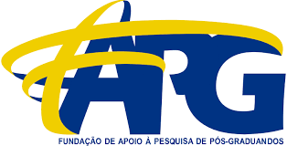

# API 4º Semestre - 01/2025

**Parceiro Acadêmico:** [FAPG](https://fapg.org.br/)

## Resumo do Projeto 📋

Este projeto enfrentou o desafio da FAPG com a complexidade da gestão de projetos. A solução foi um sistema web intuitivo para controlar projetos e atividades em uma plataforma centralizada. O sistema organiza o fluxo de trabalho, registra tarefas e permite acompanhar o andamento com visão clara por etapa, oferecendo eficiência operacional e transparência para todos os envolvidos.

## Tecnologias Adotadas 💻

- [Figma](https://www.figma.com/): Prototipação e colaboração em UI/UX.
- [MySQL](https://www.mysql.com/): Banco relacional do sistema.
- [React](https://react.dev/): Interface baseada em componentes.
- [JavaScript](https://developer.mozilla.org/pt-BR/docs/Web/JavaScript): Linguagem base do front-end.
- [TypeScript](https://www.typescriptlang.org/): Tipagem e segurança em tempo de desenvolvimento.
- [Node.js](https://nodejs.org/): Execução do back-end.
- [Next.js](https://nextjs.org/): Framework React com SSR/SSG e rotas.
- [Prisma](https://www.prisma.io/): ORM moderno para modelagem e acesso ao banco.

## Contribuições Individuais 🎯

### Atuação como Desenvolvedor Back-end e Front-end

Atuei como Product Owner, mantendo contato com o cliente para definir e refinar requisitos, esclarecer dúvidas e organizar o Backlog. Também defini e priorizei tarefas ao longo do desenvolvimento.

Atuei como Full-Stack, iniciando pela modelagem do banco para garantir uma estrutura sólida e escalável.

No back-end, implementei o fluxo de cadastro e a autenticação com JWT. Também desenvolvi regras de negócio e rotas para gestão de tarefas e acompanhamento de projetos.

No front-end, criei a página de perfil do usuário, com painel de projetos e tarefas urgentes. Também integrei a função de troca de senha para gerenciamento de conta.

## Aprendizados Efetivos 📖

O desenvolvimento do sistema para a FAPG elevou meu nível técnico. Na camada de dados, aprofundei a modelagem e usei o Prisma ORM para otimizar consultas. No front-end, evoluí no React com gerenciamento de estado e uso avançado do `useEffect`, entendendo melhor o ciclo de vida. Também consolidei minha base no ecossistema Node.js.

### Hard Skills

| Tecnologia/Metodologia | Nota | Classificação |
| --- | --- | --- |
| Figma | ★★★★★ | Sei fazer com autonomia |
| React | ★★★★☆ | Sei fazer com ajuda |
| MySQL | ★★★★★ | Sei fazer com autonomia |
| JavaScript | ★★★★☆ | Sei fazer com ajuda |
| TypeScript | ★★★★☆ | Sei fazer com ajuda |
| Node.js | ★★★★☆ | Sei fazer com ajuda |
| Git | ★★★★★ | Sei fazer com autonomia |
| Next.js | ★★★☆☆ | Entendi |
| Prisma | ★★★★☆ | Sei fazer com ajuda |

### Soft Skills

| Habilidade | Descrição |
| --- | --- |
| Comunicação | Alinhei requisitos com o cliente e esclareci dúvidas com o time. |
| Organização e gestão | Defini backlog e priorizei tarefas para manter o fluxo de entrega. |
| Responsividade | Garanti experiência consistente em diferentes telas. |
| Acessibilidade | Adotei práticas para tornar a aplicação mais inclusiva. |
| Otimização de Desempenho | Apliquei técnicas como lazy loading e minimização. |
